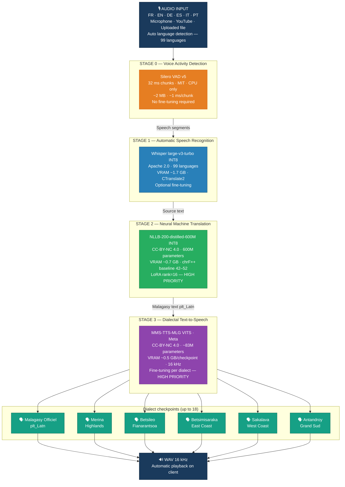
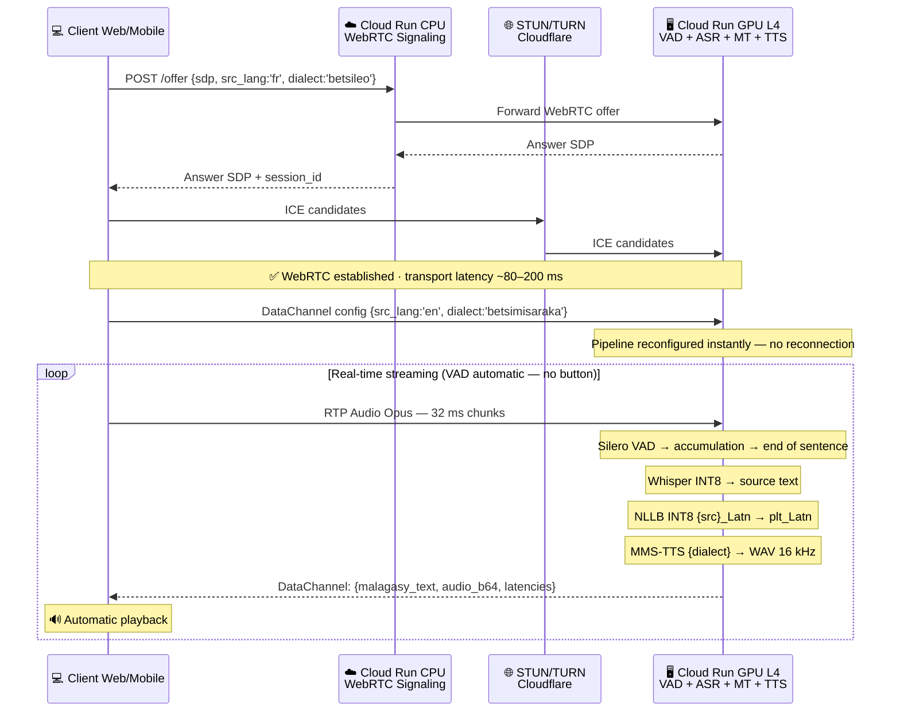
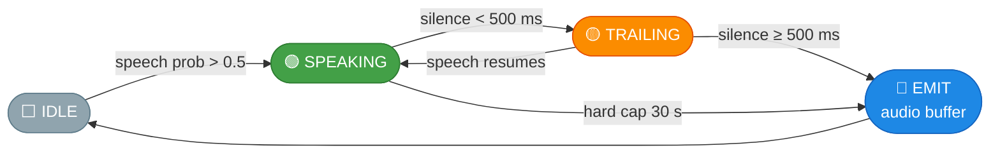
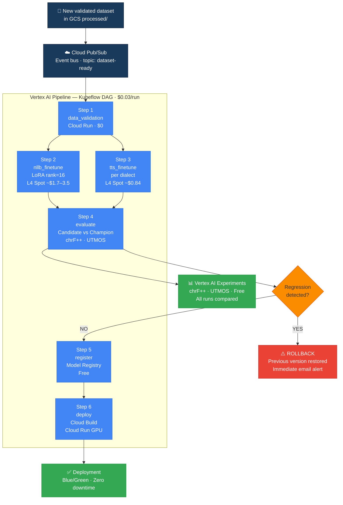
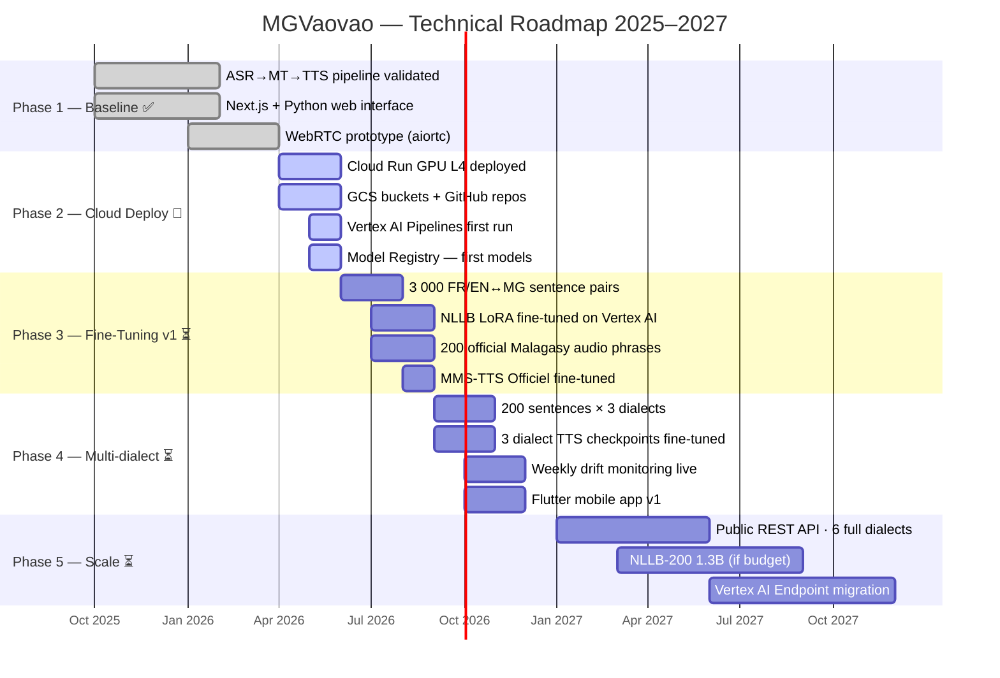

# MGVaovao — Malagasy Multilingual Speech-to-Speech Translation Pipeline

Real-time speech-to-speech translation from six international languages into Malagasy dialects.  
**Input:** spoken audio in FR · EN · DE · ES · IT · PT  
**Output:** Malagasy speech, dialect-specific, streamed back automatically via WebRTC / WebSocket.

Built for [Maison du Numérique](https://mgvaovao.com) — a non-profit bringing digital inclusion to Madagascar.  
Architecture and engineering: tsanta@mgvaovao.com

---

## Table of Contents

1. [What This Is](#1-what-this-is)
2. [Supported Dialects & Use Cases](#2-supported-dialects--use-cases)
3. [Model Stack](#3-model-stack)
4. [Why These Specific Models — Full Exclusion Tables](#4-why-these-specific-models--full-exclusion-tables)
5. [Architecture Overview](#5-architecture-overview)
6. [Cascade Architecture: Design Rationale](#6-cascade-architecture-design-rationale)
7. [WebRTC Real-Time Transport](#7-webrtc-real-time-transport)
8. [Project Structure](#8-project-structure)
9. [Prerequisites](#9-prerequisites)
10. [Local Development (no Docker)](#10-local-development-no-docker)
11. [Docker — CPU (CI / no GPU)](#11-docker--cpu-ci--no-gpu)
12. [Docker — GPU (primary)](#12-docker--gpu-primary)
13. [API Reference](#13-api-reference)
14. [WebSocket Streaming](#14-websocket-streaming)
15. [Real-Time Browser UI](#15-real-time-browser-ui)
16. [Training Pipeline](#16-training-pipeline)
17. [Fine-Tuning Guide](#17-fine-tuning-guide)
18. [GCP Deployment](#18-gcp-deployment)
19. [Environment Variables](#19-environment-variables)
20. [MLOps & Monitoring](#20-mlops--monitoring)
21. [Cost Reference](#21-cost-reference)
22. [Roadmap](#22-roadmap)
23. [Feasibility & Risk Matrix](#23-feasibility--risk-matrix)
24. [Technical References](#24-technical-references)
25. [License](#25-license)

---

## 1. What This Is

MGVaovao translates foreign-language audio (YouTube videos, podcasts, live speech) into spoken Malagasy automatically — no button required. The user selects a source language and target dialect; the system detects speech, transcribes it, translates it, and synthesizes the audio in the chosen dialect.

**Primary use case:** a YouTube video in English is inaccessible to the majority of Malagasy speakers. This system translates and delivers the audio automatically in the chosen dialect — the user simply selects language and dialect, and translation happens without clicking any button.

The pipeline is a **four-stage cascade**:

```
Audio in  →  [VAD]  →  [ASR]  →  [NLLB MT]  →  [TTS]  →  WAV out
              Silero    Whisper    NLLB-200       MMS-TTS
              VAD v5    turbo      distilled-600M  MLG (VITS)
```

Every stage is independently fine-tuneable. The architecture is intentionally modular: swap out any component without touching the others.

> No end-to-end speech-to-speech system for Malagasy existed publicly as of April 2026. Comprehensive exclusion tables for all evaluated alternatives are in [§4](#4-why-these-specific-models--full-exclusion-tables).

---

## 2. Supported Dialects & Use Cases

| Dialect key | Display name | Region | Est. speakers |
|---|---|---|---|
| `plt_latn` | Malagasy Officiel | Hautes Terres — Antananarivo | National reference |
| `betsileo` | Betsileo | Fianarantsoa — Southern Highlands | ~1.5 M |
| `betsimisaraka` | Betsimisaraka | East Coast — Toamasina | ~1.5 M |
| `sakalava` | Sakalava | West Coast — Mahajanga / Toliara | ~1 M |
| `antandroy` | Antandroy | Grand Sud — Ambovombe | ~800 K |
| `merina` | Merina | Imerina — Central Highlands | ~4 M |

Source languages supported: `fr`, `en`, `de`, `es`, `it`, `pt` (auto-detected by Whisper if not specified).

**Representative use cases:**

- English documentary → redelivered in Betsimisaraka (East Coast)
- French online course → accessible in Betsileo (Fianarantsoa)
- International speech in real-time → translated into Sakalava (West Coast)
- Foreign news content → in Malagasy Officiel for nationwide access

**Prototyping platforms:** dedicated web app in Next.js + Python (user validation), and Kaggle (T4 × 2 GPU, 30 h/week free) for hyperparameter exploration during fine-tuning.

---

## 3. Model Stack

| Stage | Model | Licence | VRAM (INT8) | Fine-tunable |
|---|---|---|---|---|
| VAD | Silero VAD v5 | MIT | 0 (CPU only) | Not needed |
| ASR | Whisper large-v3-turbo | Apache 2.0 | ~1.7 GB | Optional |
| Translation | NLLB-200-distilled-600M | CC-BY-NC 4.0 | ~0.7 GB | **Yes — high priority** |
| TTS | MMS-TTS-MLG (VITS) | CC-BY-NC 4.0 | ~0.5 GB / checkpoint | **Yes — per dialect** |

### VRAM allocation — NVIDIA L4 24 GB

| Component | VRAM |
|---|---|
| Whisper large-v3-turbo INT8 | 1.7 GB |
| NLLB-200-distilled-600M INT8 | 0.7 GB |
| 6 × TTS dialect checkpoints | 3.0 GB |
| CUDA overhead | 0.8 GB |
| **Total used** | **6.2 GB** |
| **Free headroom** | **17.8 GB** |

> 3–5 concurrent WebRTC/WebSocket sessions per instance · L4 Spot ~$0.28/h · fine-tuning via Vertex AI Training

### Fine-tunability summary

| Component | Model | Fine-tunable | Priority | Licence | Cost per run |
|---|---|---|---|---|---|
| VAD | Silero VAD v5 | Not needed | — | MIT | — |
| ASR | Whisper turbo | Yes (optional) | Low | Apache 2.0 | ~$2–5 |
| Translation | NLLB-200-600M | **Yes** | **High** | CC-BY-NC | ~$1.68–3.48 |
| TTS | MMS-TTS-MLG | **Yes** | **High** | CC-BY-NC | ~$0.56–1.16 |

### Model details

**Silero VAD v5** — 2 MB, MIT, CPU-only. Requires exactly 512 samples (32 ms) at 16 kHz. Universal, no language dependency. ~1 ms/chunk latency.

**Whisper large-v3-turbo** — best open-source multilingual ASR, 99 languages, INT8 via CTranslate2 at ~1.7 GB VRAM. WER on French (FLEURS): ~4–6%. `vad_filter=True` runs VAD and ASR in parallel to reduce latency.

**NLLB-200-distilled-600M** — only open-source MT model with `plt_Latn` (Malagasy) in its tokenizer and FLORES-200 test set. LoRA fine-tuneable (rank 16). chrF++ baseline: `en→plt_Latn` ~47–52, `fr→plt_Latn` ~42–48. CC-BY-NC is compatible with non-commercial NGO use.

**MMS-TTS-MLG (VITS)** — the **only** viable open-source TTS model for Malagasy as of 2026. ~83 M parameters, 16 kHz output. Fine-tuneable with as few as 80–150 sentences via [`ylacombe/finetune-hf-vits`](https://github.com/ylacombe/finetune-hf-vits). ~0.5 GB VRAM per dialect checkpoint.

---

## 4. Why These Specific Models — Full Exclusion Tables

No system was chosen by default. Every major commercial and open-source alternative was evaluated. The tables below document the full exclusion rationale.

### 4.1 — Speech-to-Speech systems (S2S)

| System | Developer | Malagasy status | Exclusion reason |
|---|---|---|---|
| SeamlessM4T v2 | Meta AI | Absent | `plt_Latn` absent from 96 target languages — `ValueError` confirmed |
| SeamlessM4T-medium | Meta AI | Absent | Same NLLB backbone — same limitation |
| SeamlessExpressive | Meta AI | Absent | 6 languages only (FR/EN/ES/DE/ZH/PT) |
| AudioPaLM | Google | Absent | Not publicly available — internal research |
| Translatotron 2/3 | Google | Absent | Not publicly available — internal research |
| SpeechX | Microsoft | Absent | Not publicly available |
| USM (Universal Speech Model) | Google | ASR only | ASR only — no Malagasy TTS integrated |

### 4.2 — Text-to-Speech systems (TTS)

| System | Developer | Malagasy | Fine-tuneable | Primary limitation |
|---|---|---|---|---|
| Google Cloud TTS | Google | Absent | No (closed API) | No Malagasy voice in GCP catalog |
| Amazon Polly | Amazon | Absent | No (closed API) | Malagasy absent — no published roadmap |
| Azure Neural TTS | Microsoft | Absent | No (closed API) | Absent from Azure catalog (140+ languages) |
| OpenAI TTS | OpenAI | Absent | No | 6 multilingual voices — no Malagasy |
| ElevenLabs | ElevenLabs | Absent | Voice clone only | 32 languages — Malagasy absent |
| Bark (Suno AI) | Suno AI | Partial, unstable | Not published | Uncontrolled outputs — no stable MG support |
| XTTS v2 (Coqui) | Coqui AI | Absent | Yes (if data) | 17 languages only — requires ~6 h audio |
| Parler-TTS | HuggingFace | Absent | Yes, Apache 2.0 | Requires 5–10 h Malagasy audio — long-term alternative |
| **MMS-TTS-MLG (Meta)** | Meta AI | **Present** | **Yes, CC-BY-NC** | ✅ **Selected — only viable system** |

### 4.3 — Machine Translation systems (MT)

| System | Licence | Malagasy | Primary limitation |
|---|---|---|---|
| **NLLB-200-600M / 1.3B / 3.3B (Meta)** | CC-BY-NC 4.0 | Yes — `plt_Latn` | ✅ **Selected — LoRA fine-tuneable, NGO-compatible** |
| MADLAD-400 7B (Google) | Apache 2.0 | Yes — `mdy` | 7B params — VRAM ~14 GB — too heavy for L4 |
| Google Cloud Translation API | Paid API | Yes | $20/1 M chars — fine-tuning impossible — vendor lock-in |
| DeepL API | Paid API | Absent | 32 languages only — Malagasy absent |
| M2M-100 (Meta) | MIT | Yes — `mg` | Less accurate than NLLB on low-resource languages |
| mBART-50 (Meta) | MIT | Absent | 50 languages — Malagasy absent |
| Gemini / GPT-4 | Paid API | Partial | Variable quality on MG — high cost — no fine-tuning |

### 4.4 — Automatic Speech Recognition systems (ASR)

| System | Licence | Languages | Status and limitation |
|---|---|---|---|
| **Whisper large-v3-turbo (OpenAI)** | Apache 2.0 | 99 | ✅ **Selected — multilingual, open-source, INT8, fine-tuneable** |
| Whisper distil-fr (bofenghuang) | MIT | FR only | WER FR 5.40% FLEURS — for French-only demo |
| Google Chirp 3 (GCP API) | GCP API — $0.96/hr | 125 | Native Vertex AI — no dedicated ASR GPU — full-GCP alternative |
| NVIDIA Canary 1B v2 | Apache 2.0 | 4 | Best open-source WER FR 4.86% — but 4 languages only |
| Deepgram Nova-3 | Paid API — $0.31/hr | 36 | Option if L4 GPU cost exceeds API cost |
| MMS ASR (`facebook/mms-300m`) | CC-BY-NC | 1162 incl. `mlg` | Useful if source audio is Malagasy (future use) — not retained v1 |
| Azure Speech | Paid API | 100+ | Performant — expensive — vendor lock-in |

> **Conclusion:** The cascaded ASR → Translation → TTS architecture is the only viable path for Malagasy in 2026. It is also the most modular for component-by-component fine-tuning.

---

## 5. Architecture Overview

### 5.1 — AI inference pipeline



### 5.2 — Google Cloud Platform (production)

```mermaid
flowchart LR
    CLIENT["💻 Client Web / Mobile\nNext.js + Python\nVercel Deploy"]

    subgraph GCP["Google Cloud Platform"]

        subgraph SIGNALING["Cloud Run CPU — WebRTC Signaling"]
            SIG["WebRTC Signaling\nFastAPI · Scale-to-zero\n~$2/month\nPOST /offer → Answer SDP"]
        end

        subgraph GPU_BLOCK["Cloud Run GPU — NVIDIA L4 24 GB"]
            PIPE["Inference Pipeline\nVAD + ASR + MT + TTS\n~$33/month · Scale-to-zero\ng2-standard-8 · 8 vCPU · 32 GB RAM\nCold start ~20–30s · pre-warmed"]
        end

        subgraph STORAGE["Google Cloud Storage"]
            GCS_MOD["gs://mgvaovao-models/\nnllb_lora_v* · ~200 MB\nmms_tts_{dialect}_v* · ~145 MB\nVersioning enabled"]
            GCS_DATA["gs://mgvaovao-datasets/\nraw/ · processed/ · reference/\neval_fixed_200.csv"]
        end

        subgraph MLOPS_BLOCK["MLOps — Vertex AI"]
            PUBSUB["Cloud Pub/Sub\nEvent bus · At-least-once\ntopic: dataset-ready"]
            PIPELINE["Vertex AI Pipeline\nKubeflow DAG · $0.03/run\n6 steps: validate→FT→eval→register→deploy"]
            TRAINING["Vertex Custom Training\nL4 Spot ~$0.28/hr\nNLLB LoRA r=16 · TTS VITS"]
            REGISTRY["Model Registry\ncandidate → staging → prod\nFree · 1-click rollback"]
            MONITORING["Vertex AI Monitoring\n~$3/month · weekly\nchrF++ & UTMOS drift"]
            CLOUDBUILD["Cloud Build\nBlue/Green Deploy\nZero downtime · auto-rollback"]
        end

        SCHEDULER["⏰ Cloud Scheduler\nPre-warm ping every 15 min\nWeekly drift evaluation"]
    end

    STUN["🌐 STUN/TURN\nCloudflare"]

    CLIENT -->|"POST /offer SDP"| SIG
    SIG -->|"Answer SDP + session_id"| CLIENT
    CLIENT <-->|"ICE candidates"| STUN
    SIG <-->|"Opus audio 32 ms"| PIPE
    PIPE <-->|"WAV 16 kHz + MG text"| CLIENT
    PIPE <-->|"Load models / save checkpoints"| GCS_MOD
    GCS_DATA -->|"upload event"| PUBSUB
    PUBSUB -->|"trigger pipeline"| PIPELINE
    PIPELINE --> TRAINING --> REGISTRY --> CLOUDBUILD --> PIPE
    SCHEDULER -->|"trigger eval"| MONITORING
    MONITORING -->|"drift detected"| PUBSUB

    classDef clientStyle fill:#ea4335,color:#fff,stroke:#c62828
    classDef gcpService fill:#4285f4,color:#fff,stroke:#2d6bd6
    classDef storageStyle fill:#fbbc04,color:#333,stroke:#f9ab00
    classDef mlopsStyle fill:#34a853,color:#fff,stroke:#249345
    classDef stunStyle fill:#607d8b,color:#fff,stroke:#455a64
    classDef schedStyle fill:#ff9800,color:#333,stroke:#e65100

    class CLIENT clientStyle
    class SIG,PIPE gcpService
    class GCS_MOD,GCS_DATA storageStyle
    class PUBSUB,PIPELINE,TRAINING,REGISTRY,MONITORING,CLOUDBUILD mlopsStyle
    class STUN stunStyle
    class SCHEDULER schedStyle
```



### 5.3 — Latency breakdown (L4 GPU, warm)

| Stage | Latency |
|---|---|
| Silero VAD (end-of-speech detection) | 1–50 ms |
| Whisper large-v3-turbo INT8 (3 s audio) | 250–500 ms |
| NLLB-200-600M INT8 (short sentence) | 80–350 ms |
| MMS-TTS VITS (short sentence) | 150–450 ms |
| WebRTC / WebSocket encode + transport | 50–150 ms |
| **Total — first audio chunk (warm)** | **~700–1 500 ms** |

**Optimizations active:** `vad_filter=True` (VAD + ASR in parallel), `num_beams=2`, TTS checkpoints pre-loaded in VRAM, 32 ms chunks.

---

## 6. Cascade Architecture: Design Rationale

A cascade architecture decomposes a complex task into a series of specialized steps, each processing the output of the previous one. Every component is a separate AI model trained independently for a specific function.

| Stage | Component | Role | Input → Output |
|---|---|---|---|
| 0 — Voice detection | Silero VAD v5 | Detect active speech segments, ignore silence and noise | Continuous audio → Speech segments |
| 1 — Transcription | Whisper large-v3-turbo | Transcribe source audio to text in its original language | Audio segment → Source text |
| 2 — Translation | NLLB-200-distilled-600M | Translate source text to Official Malagasy (`plt_Latn`) | Source text → Malagasy text |
| 3 — Voice synthesis | MMS-TTS-MLG (VITS) | Synthesize Malagasy text as audio in the chosen dialect | Malagasy text → WAV 16 kHz |

### Advantages for MGVaovao

- **Modularity**: each component replaceable independently without touching the others
- **Targeted fine-tuning**: improve only the weakest link based on available data
- **Low-cost dialect expansion**: one additional TTS checkpoint per dialect
- **L4 GPU compatible**: total footprint ~6.2 GB — 17.8 GB headroom free
- **Observability**: chrF++ (translation) and UTMOS (TTS) metrics per component

### Known limitations

- **Error accumulation**: an ASR error propagates into MT then TTS — mitigation: `vad_filter=True`
- **Additive latency**: ~700–1 500 ms total — mitigation: 32 ms streaming chunks, `num_beams=2`, INT8
- **Fixed TTS voice**: output voice is that of the TTS model, not the original speaker

> These limitations are acceptable: the priority is content intelligibility and accessibility, not preserving the source speaker's timbre.

---

## 7. WebRTC Real-Time Transport



### GCP architecture flows — summary table

| Flow | Represented path | Key components |
|---|---|---|
| 2a | WebRTC connection | Client Web → Cloud Run CPU (Signaling) |
| 2b | Inference pipeline | Cloud Run CPU → Cloud Run GPU L4 (VAD+ASR+MT+TTS) |
| 2c | Model storage | Cloud Run GPU ↔ Google Cloud Storage |
| 2d | Training trigger | GCS Dataset → Pub/Sub → Vertex Pipeline |
| 2e | Model lifecycle | Vertex Training → Model Registry → Cloud Build → Deploy |
| 2f | Drift monitoring | Cloud Scheduler → Vertex Monitoring → Pub/Sub → Re-FT |

---

## 8. Project Structure

```
mgvaovao/
├── api/                        FastAPI application
│   ├── main.py                 App factory, lifespan (model loading), StaticFiles
│   ├── serve.py                CLI entry: uvicorn via Settings
│   └── routes/
│       ├── health.py           GET /health  GET /ready
│       ├── dialects.py         GET /dialects/
│       ├── translate.py        POST /translate/audio  POST /translate/text
│       └── stream.py           WS  /ws/stream/{dialect}
│
├── src/mgvaovao/               Installable Python package (pip install -e .)
│   ├── core/
│   │   ├── config.py           Settings (pydantic-settings, MGVAOVAO_ prefix)
│   │   └── schemas.py          Pydantic request/response + WebSocket schemas
│   ├── models/
│   │   ├── vad.py              SileroVAD  — batch, used in /translate/audio
│   │   ├── streaming_vad.py    StreamingVAD — stateful, used in /ws/stream
│   │   ├── asr.py              WhisperASR  (openai-whisper)
│   │   ├── translator.py       NLLBTranslator + optional LoRA adapter
│   │   └── tts.py              MalagasyTTS (MMS-TTS-MLG VITS)
│   └── pipeline.py             MalagasyPipeline — orchestrates all four stages
│
├── training/
│   ├── seed.py                 Create dataset folder structure + example pairs
│   ├── preprocess.py           JSONL/WAV → train/val/test splits
│   ├── train_nllb.py           NLLB LoRA fine-tuning (HuggingFace Trainer)
│   ├── train_tts.py            MMS-TTS VITS fine-tuning
│   └── evaluate.py             chrF++ (NLLB) + listening-test WAVs (TTS)
│
├── ui/
│   ├── demo.py                 Gradio UI (thin API client, no models)
│   └── static/
│       ├── index.html          Real-time WebSocket UI (served at /live)
│       ├── app.js              AudioWorklet consumer, WebSocket client, VAD bar
│       └── audio-processor.js  AudioWorklet processor (audio render thread)
│
├── deploy/
│   ├── vertex_training.yaml    Vertex AI Custom Training Job spec
│   └── cloudrun_inference.yaml Cloud Run GPU service spec
│
├── Dockerfile                  CPU image  (python:3.10-slim)  — CI only
├── Dockerfile.cuda             GPU image  (pytorch/pytorch:2.1.2-cuda11.8) — primary
├── docker-compose.yml          GPU-first compose (references Dockerfile.cuda)
├── docker-compose.cpu.yml      CPU override (merge with -f)
├── cloudbuild.yaml             Cloud Build: build + push CUDA image to Artifact Registry
├── pyproject.toml              Package metadata, dependencies, CLI entry points
└── .env.example                All configurable environment variables with defaults
```

---

## 9. Prerequisites

### Local development (no Docker)

- Python 3.10+
- CUDA-capable GPU recommended (GTX 1050 minimum; L4 for production parity)
- CUDA 11.8+ and matching cuDNN (if using GPU)
- `git`

### Docker GPU path

- Docker Desktop with WSL2 backend (Windows) or Docker Engine (Linux)
- NVIDIA Container Toolkit (`nvidia-ctk`)
- `docker compose` v2

### Cloud deployment

- Google Cloud project with billing enabled
- `gcloud` CLI authenticated
- APIs enabled: Cloud Run, Vertex AI, Cloud Build, Artifact Registry, Cloud Storage, Pub/Sub

---

## 10. Local Development (no Docker)

This is the recommended workflow for iterating on model code locally, especially on a machine with a GPU.

```bash
# 1. Clone
git clone https://github.com/mgvaovao/ml.git
cd ml

# 2. Create virtual environment
python -m venv .venv
.venv\Scripts\activate          # Windows
# source .venv/bin/activate     # Linux/Mac

# 3. Install PyTorch with CUDA (GPU) — adjust cu118 to match your CUDA version
pip install torch==2.1.2 torchaudio==2.1.2 --index-url https://download.pytorch.org/whl/cu118

# 4. Install the package and all dependencies
pip install -e .

# 5. Copy and configure env (optional — defaults work for local GPU)
cp .env.example .env
# Edit .env to override MGVAOVAO_DEVICE, MGVAOVAO_WHISPER_MODEL_SIZE, etc.

# 6. Seed the dataset folder structure
python -m training.seed --dialect betsileo

# 7. Start the API server
uvicorn api.main:app --host 0.0.0.0 --port 8000 --reload
```

Verify:
```bash
curl http://localhost:8000/health
curl http://localhost:8000/dialects/
```

Open the real-time UI: http://localhost:8000/live

---

## 11. Docker — CPU (CI / no GPU)

Used in CI pipelines and on machines without an NVIDIA GPU. Image: `python:3.10-slim` with PyTorch CPU wheels (~200 MB final image).

```bash
# Build CPU image
docker build -f Dockerfile -t mgvaovao:cpu-latest .

# Start API (CPU only)
docker-compose -f docker-compose.yml -f docker-compose.cpu.yml up -d api

# Start Gradio demo
docker-compose -f docker-compose.yml -f docker-compose.cpu.yml up -d gradio
```

---

## 12. Docker — GPU (primary)

The primary image is `pytorch/pytorch:2.1.2-cuda11.8-cudnn8-runtime` (~3.75 GB). **First pull takes time** — use Cloud Build for CI to avoid extracting the CUDA layer locally.

```bash
# Build GPU image locally (requires NVIDIA Container Toolkit)
docker build -f Dockerfile.cuda -t mgvaovao:cuda-latest .

# Or build via Google Cloud Build (faster, avoids WSL2 layer extraction)
gcloud builds submit --config cloudbuild.yaml .

# Start API server (GPU)
docker-compose up -d api

# Start Gradio demo (no GPU needed — uses api:8000 over Docker network)
docker-compose up -d gradio

# Training jobs (run-and-exit containers)
docker-compose run --rm seed          # initialize dataset structure
docker-compose run --rm preprocess    # raw → train/val/test splits
docker-compose run --rm train-nllb    # fine-tune NLLB
docker-compose run --rm train-tts     # fine-tune TTS
docker-compose run --rm evaluate      # evaluate models
```

**Override dialect or Whisper size at runtime:**
```bash
DIALECT=sakalava docker-compose run --rm train-nllb
MGVAOVAO_WHISPER_MODEL_SIZE=medium docker-compose up api
```

**Check logs:**
```bash
docker-compose logs -f api
docker-compose logs -f gradio
```

---

## 13. API Reference

Base URL (local): `http://localhost:8000`

### Health

```
GET /health     →  {"status": "ok"}
GET /ready      →  {"status": "ready", "dialects_loaded": [...]}
```

`/ready` returns 503 until all dialect pipelines are loaded (models downloaded on first run).

### Dialects

```
GET /dialects/
```

Response:
```json
[
  {
    "key": "plt_latn",
    "name": "Malagasy Officiel",
    "region": "Hautes Terres — Antananarivo",
    "nllb_target": "plt_Latn",
    "has_nllb_lora": false,
    "has_tts_checkpoint": false
  }
]
```

### Audio translation (batch)

```
POST /translate/audio?dialect=betsileo&src_lang=fr
Content-Type: multipart/form-data
Body: file=<WAV or MP3>
```

Response:
```json
{
  "source_text": "Bonjour tout le monde",
  "malagasy_text": "Miarahaba anareo rehetra",
  "audio_url": "/translate/audio/abc123.wav",
  "latency_ms": 1240
}
```

### Text translation (batch)

```
POST /translate/text
Content-Type: application/json
Body: {"text": "Hello world", "dialect": "betsileo", "src_lang": "en"}
```

Response:
```json
{
  "source_text": "Hello world",
  "malagasy_text": "Miarahaba izao tontolo izao",
  "audio_url": "/translate/audio/def456.wav",
  "latency_ms": 890
}
```

### Download synthesized audio

```
GET /translate/audio/{filename}    →  WAV file (16 kHz mono)
```

---

## 14. WebSocket Streaming

Endpoint: `ws://localhost:8000/ws/stream/{dialect}?src_lang=fr`

`dialect`: one of `plt_latn`, `betsileo`, `betsimisaraka`, `sakalava`  
`src_lang` (optional): `fr`, `en`, `de`, `es`, `it`, `pt` — auto-detected if omitted

### Protocol

**Client → Server:** binary frames, Float32 PCM, 16 kHz, mono, 512 samples per frame (32 ms).

**Server → Client:** JSON text frames:

```jsonc
// Every 512-sample chunk:
{"type": "vad", "state": "SPEAKING", "prob": 0.94}

// When end-of-speech detected (silence ≥ 500 ms):
{"type": "processing"}

// After pipeline completes:
{
  "type": "result",
  "source_text": "Good morning",
  "malagasy_text": "Manao ahoana ny maraina",
  "audio_b64": "<base64-encoded WAV>",
  "latency_ms": 1100
}

// On error:
{"type": "error", "detail": "..."}
```

### VAD state machine



### Minimal JavaScript client

```javascript
const ws = new WebSocket("ws://localhost:8000/ws/stream/betsileo?src_lang=fr");
ws.binaryType = "arraybuffer";

ws.onmessage = (event) => {
  const msg = JSON.parse(event.data);
  if (msg.type === "result") {
    const audio = new Audio("data:audio/wav;base64," + msg.audio_b64);
    audio.play();
  }
};

// Send Float32 PCM at 16 kHz, 512 samples per frame
function sendChunk(float32Array) {
  if (ws.readyState === WebSocket.OPEN) {
    ws.send(float32Array.buffer);
  }
}
```

---

## 15. Real-Time Browser UI

Open http://localhost:8000/live after starting the API server.

Features:
- Dialect selector (populated from `/dialects/`)
- Source language selector
- VAD probability bar (animates in real-time)
- VAD state chip (IDLE / SPEAKING / TRAILING)
- Source transcript panel
- Malagasy translation panel
- Latency breakdown table
- Activity log

The UI uses the AudioWorklet API for low-latency microphone capture (128-sample blocks forwarded to a 512-sample accumulator before sending over WebSocket). No file upload — VAD triggers processing automatically on silence.

**Browser requirements:** Chrome or Edge (AudioWorklet support required). Firefox partial support.

---

## 16. Training Pipeline

All training scripts are in `training/`. They can be run directly, via CLI entry points, or as Docker Compose one-shot containers.

### Step 0 — Seed dataset structure

```bash
python -m training.seed --dialect betsileo
mgvaovao-seed --dialect betsileo        # CLI entry point
docker-compose run --rm seed            # Docker
```

Creates:
```
dataset/
├── nllb_finetune/betsileo/
│   ├── raw/fr/         ← drop JSONL files here: {"src": "...", "tgt": "..."}
│   ├── raw/en/
│   ├── processed/
│   └── reference/eval_fixed_200.csv
└── tts_finetune/betsileo/
    ├── raw_audio/       ← drop WAV files + metadata.csv here
    └── processed_audio/
```

### Step 1 — Preprocess

```bash
python -m training.preprocess --dialect betsileo
```

NLLB input format (`raw/fr/*.jsonl`, one JSON object per line):
```json
{"src": "Bonjour tout le monde", "tgt": "Miarahaba anareo rehetra"}
```

TTS input: WAV files (16 kHz mono) in `raw_audio/` + a `metadata.csv`:
```
filename,text
phrase_001.wav,Miarahaba anareo rehetra
phrase_002.wav,Misaotra betsaka
```

Split ratio: 80% train / 10% val / 10% test. Minimum 80 samples for TTS.

### Step 2a — Fine-tune NLLB

```bash
python -m training.train_nllb --dialect betsileo

python -m training.train_nllb \
  --dialect betsileo \
  --epochs 10 \
  --batch 2 \
  --lr 3e-4
```

| Parameter | Default | Env var |
|---|---|---|
| LoRA rank | 16 | `MGVAOVAO_NLLB_LORA_R` |
| LoRA alpha | 32 | `MGVAOVAO_NLLB_LORA_ALPHA` |
| Target modules | `q_proj, v_proj` | `MGVAOVAO_NLLB_LORA_TARGET_MODULES` |
| Epochs | 5 | `MGVAOVAO_NLLB_TRAIN_EPOCHS` |
| Batch size | 1 | `MGVAOVAO_NLLB_BATCH_SIZE` |
| Gradient accumulation | 8 | `MGVAOVAO_NLLB_GRAD_ACCUM` |
| Learning rate | 5e-4 | `MGVAOVAO_NLLB_LR` |
| FP16 | true | `MGVAOVAO_NLLB_FP16` |

Checkpoint saved to: `checkpoints/nllb_{dialect}/`

### Step 2b — Fine-tune TTS

```bash
python -m training.train_tts --dialect betsileo

python -m training.train_tts \
  --dialect betsileo \
  --epochs 100 \
  --lr 5e-5
```

Checkpoint saved to: `checkpoints/tts_{dialect}/`

### Step 3 — Evaluate

```bash
python -m training.evaluate --dialect betsileo
```

Outputs:
- `eval_results.csv` — chrF++ scores (NLLB), listening-test WAVs (TTS)
- Console report comparing baseline vs fine-tuned model
- WAVs saved to `eval_audio/`

---

## 17. Fine-Tuning Guide

### NLLB — what to expect

- Baseline chrF++ (`en→plt_Latn`): ~47–52 before fine-tuning
- Expected gain with 3 000 sentence pairs: **+2 to +8 chrF++ points**
- Fine-tuning time on L4 Spot (5 epochs, batch=1, grad_accum=8): **~$1.68–$3.48**

### TTS — what to expect

- Minimum viable dataset: **80 sentences** (per `ylacombe/finetune-hf-vits` README — verified)
- Target: 200+ sentences for robust dialect adaptation
- Fine-tuning time on L4 Spot (50 epochs): **~$0.56–$1.16**
- UTMOS improvement typically +0.3–0.8 points

### Using fine-tuned checkpoints

The inference pipeline loads fine-tuned adapters automatically at startup if the checkpoint directory exists:

```
checkpoints/nllb_betsileo/      ← NLLB LoRA adapter files
checkpoints/tts_betsileo/       ← TTS VITS checkpoint
```

If the directory is absent, the base pre-trained model is used. No code change needed.

### Uploading checkpoints to GCS (for Cloud Run)

```bash
gsutil -m cp -r checkpoints/nllb_betsileo/ gs://mgvaovao-models/nllb_lora_v1/
gsutil -m cp -r checkpoints/tts_betsileo/  gs://mgvaovao-models/mms_tts_betsileo_v1/
```

---

## 18. GCP Deployment

### Build and push CUDA image (Cloud Build)

```bash
gcloud builds submit --config cloudbuild.yaml .
```

Builds `Dockerfile.cuda` and pushes two tags to Artifact Registry:
- `cuda-{SHORT_SHA}` (immutable, per-commit)
- `cuda-latest` (rolling)

Machine: `E2_HIGHCPU_8` (~8 min build). No local Docker required.

### Deploy to Cloud Run GPU

```bash
gcloud run services replace deploy/cloudrun_inference.yaml \
  --region us-central1
```

Key specs (`cloudrun_inference.yaml`):
- Machine: `g2-standard-8` (8 vCPU, 32 GB RAM)
- GPU: NVIDIA L4, `--no-gpu-zonal-redundancy`
- Scaling: min 1, max 4 instances
- Startup probe: 60 s timeout (model loading)
- WebSocket support: `--session-affinity`

Cold start is ~20–30 s (models loaded from GCS). Cloud Scheduler pings every 15 min to keep warm.

### Launch a Vertex AI training job

```bash
gcloud ai custom-jobs create \
  --region=us-central1 \
  --display-name="nllb-finetune-betsileo" \
  --config=deploy/vertex_training.yaml
```

Specs (`vertex_training.yaml`):
- Machine: `n1-standard-8` + NVIDIA Tesla T4
- Spot: yes (~60% cheaper)
- GCS bucket mounted at `/mgvaovao/dataset` and `/mgvaovao/checkpoints`
- Checkpoint auto-saved to GCS every 30 min

### GCS bucket layout

```
gs://mgvaovao-models/
├── nllb_lora_v1/               NLLB LoRA adapter (~200 MB)
├── nllb_lora_betsileo_v1/
├── mms_tts_plt_latn_v1/        TTS checkpoint (~145 MB)
└── mms_tts_betsileo_v1/

gs://mgvaovao-datasets/
├── raw/                        Annotator uploads (JSONL + WAV)
├── processed/                  Train/val/test splits
├── reference/
│   └── eval_fixed_200.csv      Fixed evaluation set (drift monitoring)
└── eval_fixed/
```

---

## 19. Environment Variables

All variables use the `MGVAOVAO_` prefix. Copy `.env.example` and override as needed.

| Variable | Default | Description |
|---|---|---|
| `MGVAOVAO_DEVICE` | `cuda` | `cuda` or `cpu` |
| `MGVAOVAO_WHISPER_MODEL_SIZE` | `small` | `tiny` `base` `small` `medium` `large` |
| `MGVAOVAO_API_HOST` | `0.0.0.0` | Uvicorn bind host |
| `MGVAOVAO_API_PORT` | `8000` | Uvicorn bind port |
| `MGVAOVAO_API_WORKERS` | `1` | Uvicorn workers (keep 1 with GPU) |
| `MGVAOVAO_NLLB_MODEL_NAME` | `facebook/nllb-200-distilled-600M` | HuggingFace model ID |
| `MGVAOVAO_NLLB_LORA_R` | `16` | LoRA rank |
| `MGVAOVAO_NLLB_TRAIN_EPOCHS` | `5` | Training epochs |
| `MGVAOVAO_NLLB_BATCH_SIZE` | `1` | Per-device batch size |
| `MGVAOVAO_NLLB_LR` | `5e-4` | Learning rate |
| `MGVAOVAO_TTS_MODEL_NAME` | `facebook/mms-tts-mlg` | HuggingFace TTS model ID |
| `MGVAOVAO_TTS_TRAIN_EPOCHS` | `50` | TTS fine-tuning epochs |
| `MGVAOVAO_VAD_THRESHOLD` | `0.5` | Silero VAD speech probability threshold |
| `MGVAOVAO_VAD_MIN_SPEECH_MS` | `250` | Min speech duration (batch VAD) |
| `MGVAOVAO_VAD_MIN_SILENCE_MS` | `100` | Min silence between segments (batch VAD) |
| `MGVAOVAO_VAD_STREAM_MIN_SILENCE_MS` | `500` | Silence to trigger end-of-utterance (streaming VAD) |
| `DIALECT` | `betsileo` | Default dialect for Docker Compose training commands |

Paths (override only if not using Docker volumes):

| Variable | Default |
|---|---|
| `MGVAOVAO_ROOT_DIR` | `/mgvaovao` |
| `MGVAOVAO_CHECKPOINTS_DIR` | `/mgvaovao/checkpoints` |
| `MGVAOVAO_DATASET_DIR` | `/mgvaovao/dataset` |
| `MGVAOVAO_HF_CACHE_DIR` | `/mgvaovao/.cache/huggingface` |

---

## 20. MLOps & Monitoring

### Automated training pipeline



### Drift monitoring thresholds

| Metric | Alert threshold | Automatic action |
|---|---|---|
| chrF++ on 200 fixed reference sentences | Drop > 2 points | Trigger NLLB re-fine-tuning via Pub/Sub |
| UTMOS on 50 audio test sentences | Drop > 0.3 | Trigger TTS re-fine-tuning via Pub/Sub |
| Pipeline WebRTC error rate | > 5% | Email alert + immediate infra investigation |
| P95 pipeline latency | > 2 000 ms | Email alert + Cloud Monitoring investigation |

All training runs tracked in **Vertex AI Experiments** (free).

### Pre-warming strategy

Cloud Scheduler pings Cloud Run GPU every 15 min to prevent cold starts during active hours. Scale-to-zero preserved during nights and weekends.

---

## 21. Cost Reference

### Beta phase budget — ~$42/month (< 100 users/day)

| Item | Monthly cost |
|---|---|
| Cloud Run GPU L4 (50 h active) | $33.60 |
| Vertex AI Monitoring | $3.00 |
| Vertex AI Custom Training (2 runs/month) | $2.24 |
| Cloud Run CPU (WebRTC signaling) | $2.00 |
| Google Cloud Storage (50 GB) | $1.00 |
| Vertex AI Pipelines | $0.12 |
| Artifact Registry | $0.50 |
| Vertex Experiments + Registry | $0.00 |
| Cloud Build CI/CD | $0.00 |
| **Total** | **~$42/month** |

### Budget evolution by phase

| Phase | Users | Estimated budget |
|---|---|---|
| Beta | < 100 users/day | ~$42/month |
| Growth | 100–500 users/day | ~$100/month |
| Production | > 500 users/day | ~$500+/month |
| Vertex AI Endpoint migration threshold | > 500 users/day | Migrate to Endpoint |

### Active optimizations

| Optimization | Saving |
|---|---|
| Scale-to-zero (Cloud Run) | $0.00 outside active hours |
| Spot instances for fine-tuning | –60% to –91% vs on-demand |
| INT8 quantization (CTranslate2) | –50% VRAM · ×2 speed |
| Kaggle free T4 × 2 | 30 h/week at no cost |
| LoRA fine-tuning (vs full FT) | Only a fraction of parameters retrained |

---

## 22. Roadmap



| Phase | Status | Key deliverables |
|---|---|---|
| Phase 1 — Baseline | ✅ Done | VAD→ASR→NLLB→TTS pipeline · WebSocket streaming · Real-time browser UI · Docker images |
| Phase 2 — Cloud Deploy | 🔄 In progress (Q2 2026) | Cloud Run GPU L4 · GCS buckets · Vertex AI Pipeline first run · Model Registry |
| Phase 3 — Fine-Tuning v1 | ⏳ Q2–Q3 2026 | 3 000 FR/EN↔MG pairs · NLLB LoRA fine-tuned · 200 audio phrases · MMS-TTS Officiel fine-tuned · chrF++ and UTMOS published |
| Phase 4 — Multi-dialect | ⏳ Q3–Q4 2026 | 200 sentences × 3 dialects · 3 TTS checkpoints · Drift monitoring live · Flutter mobile app v1 |
| Phase 5 — Scale | 2027 | Public REST API · 6 full dialects · NLLB-200 1.3B (if budget) · Vertex AI Endpoint migration |

---

## 23. Feasibility & Risk Matrix

### Technically validated points

- ASR → MT → TTS pipeline functional in Malagasy: demonstrated in prototype
- `plt_Latn` confirmed in NLLB-200 tokenizer and FLORES-200 test set
- MMS-TTS-MLG fine-tuneable from 80–150 samples: verified in `ylacombe/finetune-hf-vits` official README
- Cloud Run GPU L4 GA since June 2, 2025: source Google Cloud Blog (official)
- Vertex AI Model Registry free: confirmed in GCP official documentation
- LoRA NLLB-200 validated on low-resource languages: arXiv 2602.04442
- Silero VAD v5 MIT ~2 MB CPU-only: github.com/snakers4/silero-vad
- `aiortc` supports audio tracks + DataChannel simultaneously (WebRTC)
- Kaggle T4 × 2 30 h/week free: confirmed
- CTranslate2 INT8 supports CUDA CC 6.1+ for Whisper and NLLB

### Risk matrix

| Risk | Probability | Impact | Mitigation |
|---|---|---|---|
| Cold start 20–30s on Cloud Run GPU | High | Medium | Cloud Scheduler pre-warm ping every 15 min |
| Translation baseline quality insufficient | Medium | High | LoRA fine-tuning on conversational Malagasy data |
| Dialect data collection difficult | High | Medium | Start with Officiel only — dialects in phases 2/3 |
| Latency > 700ms on mobile networks in MG | High | Medium | Opus codec + chunked streaming + TURN Cloudflare |
| Spot VM interruption during fine-tuning | Medium | Low | Auto-checkpoint to GCS every 30 min |
| Monthly budget overrun | Low | Medium | Cloud Billing alerts at 80% and 95% |

---

## 24. Technical References

| Reference | Source |
|---|---|
| Cloud Run GPU GA (June 2, 2025) | cloud.google.com/blog/products/serverless/cloud-run-gpus-are-now-generally-available |
| Cloud Run pricing | cloud.google.com/run/pricing |
| Vertex AI pricing | cloud.google.com/vertex-ai/pricing |
| NLLB-200-distilled-600M | huggingface.co/facebook/nllb-200-distilled-600M |
| MMS-TTS-MLG | huggingface.co/facebook/mms-tts-mlg |
| ylacombe/finetune-hf-vits | github.com/ylacombe/finetune-hf-vits |
| Silero VAD v5 | github.com/snakers4/silero-vad |
| faster-whisper (CTranslate2) | github.com/SYSTRAN/faster-whisper |
| UTMOS metric | arxiv.org/abs/2204.02152 (Saeki et al., Interspeech 2022) |
| Whisper distil-fr | huggingface.co/bofenghuang/whisper-large-v3-french-distil-dec8 |
| NLLB LoRA on low-resource languages | arXiv:2602.04442 · arXiv:2505.14423 |
| aiortc WebRTC Python | github.com/aiortc/aiortc |
| CTranslate2 | github.com/OpenNMT/CTranslate2 |

---

## 25. License

Model licenses:
- **NLLB-200** and **MMS-TTS-MLG**: CC-BY-NC 4.0 — free for non-commercial use (fully compatible with NGO / association use)
- **Whisper**: Apache 2.0
- **Silero VAD**: MIT

Application code: contact tsanta@mgvaovao.com

---

*MGVaovao — Maison du Numérique · Ambatonakanga, Antananarivo · mgvaovao.com*
